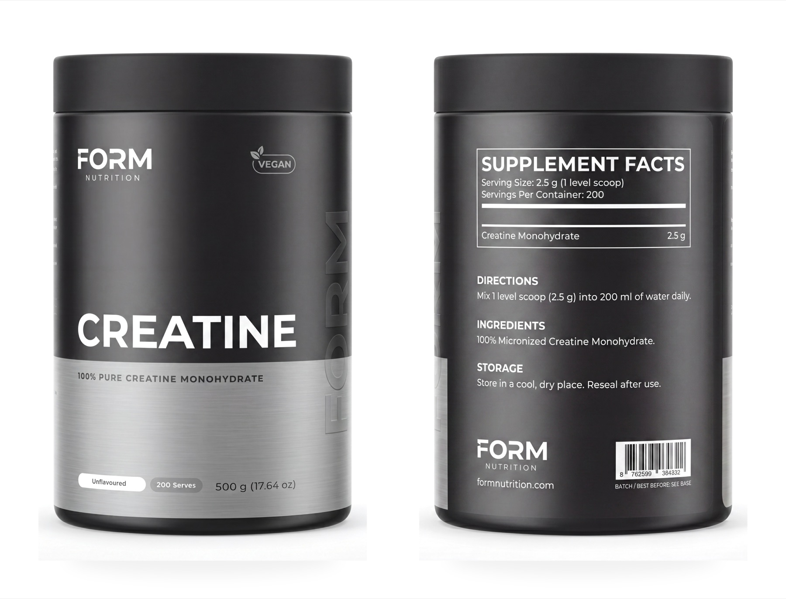

# Mira Content Engine

A command-line engine that turns a one-line brand brief into campaign-grade
product photography and short-form video, by orchestrating a fleet of
generative-image, video, and audio models behind a single, reproducible
pipeline.

This repository is a **public proof package**. It documents the architecture,
the engineering decisions, and the operational thinking behind the engine. The
working code, the brand projects, and all generated media are kept in a private
repository — see [What's intentionally excluded](#whats-intentionally-excluded).

> **Status — honest version:** this is the generation engine behind
> [Mira Content Studio](https://miracontent.studio) (live), and I use it to
> produce real creative work. It runs **operator-in-the-loop from the
> terminal** — it is not itself a hosted, multi-tenant service; the Studio's
> customer-facing front-end and commerce live in a separate repo. No usage,
> revenue, or customer numbers are claimed here. Where the docs describe
> something designed-but-not-yet-wired, they say so explicitly.

## Where this fits — the engine behind Mira Content Studio

Mira Content Engine is the private **generation backend** behind
[**Mira Content Studio**](https://miracontent.studio) — a creative-operations
product that turns a brand brief into product photography and campaign video.

The two are deliberately separated:

- **The Studio** is the customer-facing product — marketing site, portfolio,
  the social output layer, and self-serve booking/commerce. Its marketing site
  is source-available at
  [mira-content-studio-site](https://github.com/mirasolutions06/mira-content-studio-site),
  and its own README notes that "the generation engine is not in this repo."
- **The engine** — documented here — is that generation engine: the model
  orchestration, cost control, reproducibility, and brand-memory underneath. The
  code itself stays private; this package is its public proof.

In other words: the Studio is the storefront, this is the workshop behind it.

---

## What it does

Conventional product photography for a small brand means a studio, a
photographer, a model, a stylist, and a multi-week turnaround for a handful of
usable frames. Mira Content Engine compresses the *direction* and *production*
of that work into a repeatable pipeline:

```
brief  →  director (prompt enrichment)  →  config.json  →  pipeline  →  versioned output
                                                              ↘ brand library accumulates winners
```

1. **Director** — a markdown-defined "photography director" reads the brand,
   the reference images, and a reference library (photographers, lighting
   setups, lenses, film/color grades) and writes a fully-specified photographic
   brief for each shot. This step makes **no API call** — it is structured
   knowledge, not a model.
2. **Pipeline** — a TypeScript CLI takes the enriched config and generates each
   scene against the chosen provider, applying reference filtering, style
   anchoring, cost tracking, and versioned output.
3. **Brand library** — winning frames are tagged and stored per brand, then fed
   back as visual references on later runs, so a brand's look gets more
   consistent over time rather than drifting.

It runs in three modes: **images** (the hot path), **video**, and **overlay**
(typographic text-on-photo for campaign lockups).

## Sample output

A few frames the engine produced (the author's own concept work, fully
AI-generated, resized for the web). More — and the engineering each one proves —
in [examples/outputs/](examples/outputs/).

| On-model lifestyle | Action / product-in-use | Packshot + text fidelity |
|---|---|---|
|  |  |  |
| Real skin, not airbrushed "AI look" | Legible label in motion, correct scale | Crisp small text; front/back composed to match |

## Why it exists

It started as a way to make my own brand and product work cheaper and faster
than commissioning a shoot per idea, and to stop re-deriving the same lighting
and lens decisions every time. The interesting engineering problem turned out
not to be "call an image API" — it was everything around the call: keeping a
brand visually consistent across dozens of runs, spending money predictably,
recovering from the specific ways these models fail, and making every run
reproducible and reviewable.

## What systems it connects to

The engine is a thin, uniform orchestration layer over a set of external
generative models. It does not host or fine-tune any model; it adapts each
provider to one internal request/result shape.

| Capability | Providers wired |
|---|---|
| Image generation | Google Gemini (image), OpenAI GPT Image |
| Video generation | Google Veo / Veo Fast, Seedance (direct + via fal.ai), Kling, Higgsfield |
| Voice / audio | ElevenLabs (direct + via fal.ai), fal.ai lip-sync |
| Captions | Whisper (word-level timing, via OpenAI) |
| Render / compositing | Remotion (React-based video composition, lazy-loaded) |

See [docs/tool-catalog.md](docs/tool-catalog.md) for the full catalog.

## What the engine exposes

There is **one CLI entry point** and a small, explicit surface:

- **Modes:** `images`, `video`, `overlay` — selected by a discriminated-union
  config (`config.json`) per project.
- **Flags:** `--project <name>`, `--dry-run` (estimate cost, no spend),
  `--render` (enable the Remotion video render path), `--research` (opt-in web
  research tier).
- **The director skill:** a markdown knowledge base (photographer / lighting /
  lens / color-grade / pose references plus per-category playbooks) that is the
  prompt-engineering "brain." Its design is documented here; the full prompt
  text is private.

## How safety boundaries work

The engine spends real money on every run and produces brand-bearing creative,
so the safety model is mostly about **spend, reproducibility, and human review**
rather than untrusted input:

- **Dry-run first** — `--dry-run` prices a run from an explicit cost map before
  any API call.
- **Least-privilege key validation** — each run validates only the API keys for
  the providers it will actually use, and refuses to start if one is missing.
- **Approval gates** — the director presents an estimated cost and shot plan for
  approval before generating, and (by convention) pauses expensive runs after
  the first scene for a visual check.
- **Fail loud** — provider errors surface per scene and are recorded; the
  pipeline does not silently retry in a way that hides a failure or quietly
  doubles spend.
- **No secrets in code** — all credentials come from environment variables; a
  scan of the source tree for key material comes back clean.

Details and the honest gaps are in
[docs/security-and-privacy.md](docs/security-and-privacy.md).

## What's intentionally excluded

This package deliberately does **not** contain:

- **Credentials** — `.env`, API keys, or tokens of any kind.
- **The engine source code** — kept private; described here instead.
- **Brand / client projects** — ~3.6 GB of briefs, reference imagery, and
  generated stills and video across 60+ project folders. (A small curated set
  of the author's own sample frames *is* included — see
  [Sample output](#sample-output) — but the full library and the prompts that
  produced them are not.)
- **Brand memory** — the per-brand library of tagged winning frames.
- **Proprietary director prompts** — the full reference library and the exact
  enrichment prompts.
- **Internal plans and specs** — campaign design docs and roadmap notes.

The example config in [`examples/`](examples/) is a **synthetic** brand written
for this package, not a real client.

## How to read this repo quickly

| If you want… | Read |
|---|---|
| The 5-minute version | this README |
| The engineering narrative (problem → design → tradeoffs → failure modes) | [CASE_STUDY.md](CASE_STUDY.md) |
| How the pieces fit together, with diagrams | [docs/architecture.md](docs/architecture.md) |
| The privacy / spend / secrets posture | [docs/security-and-privacy.md](docs/security-and-privacy.md) |
| How it's actually run day to day | [docs/operations.md](docs/operations.md) |
| The exhaustive list of modes, providers, and skill files | [docs/tool-catalog.md](docs/tool-catalog.md) |
| A concrete config shape | [examples/example-config.json](examples/example-config.json) |
| The live product this engine powers | [miracontent.studio](https://miracontent.studio) · [site repo](https://github.com/mirasolutions06/mira-content-studio-site) |

## Verified facts in this package

Everything below was checked against the live private repository while writing
this package, not estimated:

- **3** pipeline modes, **1** CLI entry point, **4** flags.
- **10** provider adapters spanning image, video, and audio.
- **58** passing tests across **12** test files (unit + end-to-end, all
  providers mocked); `tsc --noEmit` is clean.
- Cost figures come from the engine's own cost map, not marketing numbers.

No usage metrics, adoption numbers, or performance benchmarks are claimed,
because none have been measured rigorously.
