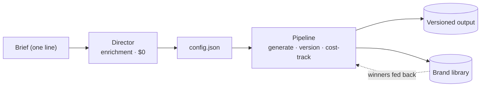

<div align="center">

# Content Engine

**One line of brief in. Campaign-grade product photography and short-form video out.**
A TypeScript engine that orchestrates around ten generative image, video, and
audio models behind one reproducible, cost-controlled pipeline.

[](LICENSE)
[](https://github.com/mirasolutions06/ai-video-image-generation-pipeline/actions/workflows/ci.yml)


  

<sub>All fully AI-generated: real on-model skin · a legible label in motion · crisp packshot text.</sub>

[Quick start](#run-it) · [Examples](examples/) · [Tool catalog](docs/tool-catalog.md) · [Operations](docs/operations.md) · [Architecture](docs/architecture.md)

</div>

## At a glance

This repo is a runnable TypeScript pipeline for generating branded product
images, short videos, and text overlays. It is useful if you want to take a
clear brief, turn it into repeatable production settings, estimate cost before
calling paid APIs, and keep every output versioned.

| This repo owns | You provide |
|---|---|
| CLI, config validation, provider adapters, cost tracking, versioned outputs, director workflow, sample configs, tests | Your project brief, provider keys, product/reference assets, review decisions, private brand library |

## Modes

| Mode | Use it for | Output |
|---|---|---|
| `images` | Product stills, lifestyle frames, campaign photography | Versioned image scenes plus `run.json` |
| `video` | Short clips, voice/caption-assisted video, rendered ads | Provider clips and optional Remotion render |
| `overlay` | Text-on-photo campaign lockups | Typeset overlay frames |

## Repository map

| Path | What it contains |
|---|---|
| `src/cli.ts` | Command-line entry point for project runs and dry runs. |
| `src/modes/` | The three production paths: `images`, `video`, and `overlay`. |
| `src/providers/` | Provider adapters for image, video, voice, and caption APIs. |
| `src/render/` | Remotion compositions for rendered ads and short-form video. |
| `src/lib/` | Costing, validation, versioning, references, memory, and retry helpers. |
| `skills/director/` | The markdown director workflow that turns briefs into shot-ready configs. |
| `examples/` | Synthetic config and sample output frames. |
| `test/` | Vitest coverage for modes, providers, validation, cost, refs, and versioning. |

## The whole idea, in one config

The naive approach, "call an image model with a prompt," gives stock-looking
output no one would pay for, and different stock-looking output every time. This
engine makes every prompt a **fully specified photographic brief**, so the model
renders a photograph that could actually exist:

```jsonc
// projects/klint/config.json  (one scene of three)
{
  "prompt": "Hero still of a matte oatmeal-glaze stoneware pour-over dripper on pale oak, three-quarter front, soft north-window daylight camera-left at 45 degrees (large soft source, fill 2:1), gentle rim, 85mm f/2.8, shallow but readable depth, Kodak Portra 400 grade, in the manner of Irving Penn still-life stillness.",
  "hasProduct": true, "hasModel": false, "isDetail": false
}
```

Shot, subject, exact materials, light direction and ratio, lens, depth, grade, a
photographer to anchor the look. That is the difference between "a bottle on a
table" and a frame a brand would pay for. The [director](#the-director) writes
these; the pipeline runs them.

## Run it

```bash
npm install
cp .env.example .env      # add GEMINI_API_KEY and/or OPENAI_API_KEY
npm test                  # 58 tests, providers mocked, no keys needed
mkdir -p projects/klint
cp examples/example-config.json projects/klint/config.json
```

Then price a run before you spend, and generate:

```console
$ npm start -- --project klint --dry-run
  images · 3 scenes · gemini-3-pro-image-preview @2K
  estimated cost: ~$0.40   (no API calls made)

$ npm start -- --project klint
  ✓ Scene 1: done   ✓ Scene 2: done   ✓ Scene 3: done
  Run v1 complete. 3/3 scenes generated. Cost: $0.39  ->  output/v1/
```

Re-run after a fix and you get `output/v2/`; the previous version is never
overwritten, and `run.json` records every prompt, reference, and cost.

## What it does

| | |
|---|---|
| **Director → config** | A markdown "photography director" turns a brief into a config where every shot is a complete photographic brief. No API call: structured judgment, not a model. |
| **Pipeline** | Generates each scene against the chosen provider, with per-scene reference filtering, a scene-1 style anchor, cost tracking, and versioned output. |
| **Brand library** | Winning frames are tagged and stored per brand, then fed back as references on later runs, so a brand's look compounds instead of drifting. |
| **Three modes** | `images` (the hot path), `video`, and `overlay` (typographic campaign lockups), selected by a discriminated-union config. |
| **Cost control** | `--dry-run` prices a run from an explicit cost map before a penny is spent; runs fail loud rather than silently re-rolling. |

## The director

The director is markdown, not code, and makes **no API call**: it reads a
reference library, picks one lighting setup and one grade for the whole batch, a
lens per scene, and a photographer to cite, then writes the config the pipeline
runs. The **method ships** in [`skills/director/`](skills/director/) (the
workflow plus `frameworks.md`: shot-card grammar, material-physics rules). The
reference catalog is a curated point of view, so it is **yours to build**: see
[`skills/director/references/README.md`](skills/director/references/README.md) for
the structure and a starter entry for each file.

## Examples

[`examples/`](examples/) has a complete synthetic `config.json` (a fictional
ceramics brand) and a set of real sample frames. Start there.

```bash
mkdir -p projects/klint
cp examples/example-config.json projects/klint/config.json
npm start -- --project klint --dry-run
```

## How it works



Direction (deciding what photograph to make) is separated from production (making
it): direction is knowledge-shaped, cheap, and reviewable; production is
API-shaped, costs money, and is deterministic and idempotent. Full detail in
[docs/architecture.md](docs/architecture.md).

## Providers

Ten adapters, normalized to one internal request/result shape, so adding a
provider is one file and the pipeline never changes.

| Capability | Providers |
|---|---|
| Image | Google Gemini, OpenAI GPT Image |
| Video | Google Veo, Seedance, Kling, Higgsfield |
| Audio / voice | ElevenLabs, Whisper (captions) |
| Render | Remotion (React-based composition, lazy-loaded) |

## Built with

TypeScript (strict) · commander · sharp · Remotion · `@google/genai` · `openai` ·
`@fal-ai/client` · ElevenLabs · Higgsfield. 58 tests (Vitest, providers mocked)
and CI.

## Honest gaps

Written up plainly in the [case study](CASE_STUDY.md): re-run inheritance is not
fully wired, the cost ceiling is a convention rather than a hard code-level limit,
and observability is per-run JSON with no metrics backend. No usage or performance
numbers are claimed.

## License

MIT, see [LICENSE](LICENSE). Use it, fork it, point it at your own brands.
