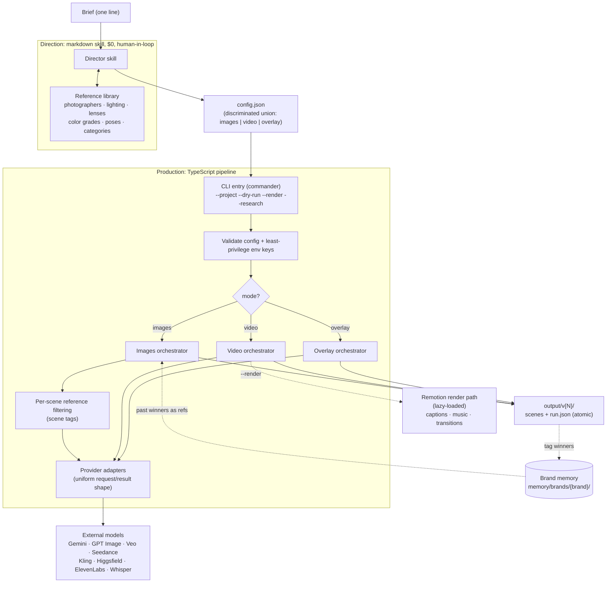
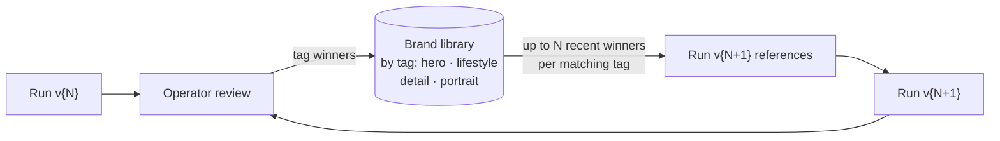
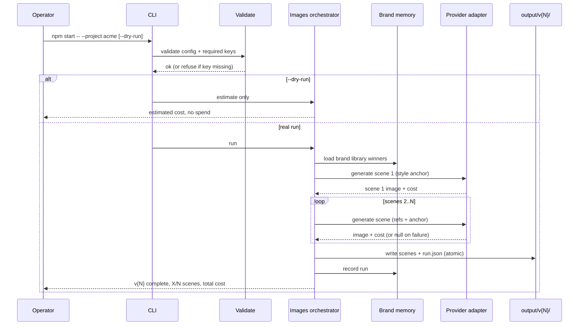

# Architecture

Mira Content Engine is a single-operator CLI that orchestrates external
generative models behind one reproducible pipeline. This document describes how
the pieces fit together. It reflects the real implementation; where something is
designed-but-not-wired it is called out.

## Design principle: separate direction from production

The system is split along the line between *judgment* and *determinism*:

- **Direction** (what photograph to make) is knowledge-shaped, cheap, and best
  kept human-reviewable. It lives in a **markdown skill**, makes no API call,
  and is free to run.
- **Production** (making it) is API-shaped, costs money, and must be
  deterministic, idempotent, and observable. It lives in a small **TypeScript
  pipeline** with a real test suite.

Everything else follows from that split.

## System overview



## Components

### CLI entry point

A single `commander` program. It requires `--project <name>`, optionally takes
`--dry-run`, `--render`, `--research`, loads the project's `config.json`, routes
on the `mode` discriminator, validates the environment keys for **only** the
providers that run will use, and dispatches to the mode orchestrator. The video
orchestrator and the Remotion render path are imported dynamically so the image
hot path never loads them.

### Config (the contract)

`config.json` is a discriminated union on `mode`:

- `ProjectConfig` (`mode: "images"`): brand, brief, default provider/model,
  formats, image size, aspect ratio, anchor toggle, and an array of `clips`
  (scenes). Each clip is an enriched prompt plus scene tags
  (`hasModel` / `hasProduct` / `isDetail`) and optional per-clip overrides.
- `VideoConfig` (`mode: "video"`): format, per-clip provider, optional
  voiceover script + voice, captions, hook text, music, transitions.
- `OverlayConfig` (`mode: "overlay"`): a campaign meta block (brand name,
  concept, palette, typography) and clips that place typographic lockups on
  existing photos using named presets.

The config is the single source of truth for a run and is snapshotted into the
output, which is what makes a run reproducible.

### Director skill (direction)

A markdown knowledge base, not code and not a model call. It holds the reference
library and per-category playbooks, and it enforces "every prompt is a complete
photographic brief" rules. It reads project refs and brand memory to decide
direction, then writes the config. Its full prompt text is private; its
structure is in [tool-catalog.md](tool-catalog.md).

### Reference filtering

Not every reference belongs in every scene. The engine filters references per
scene from the scene tags: a detail macro shouldn't receive the model
reference; a portrait should. Brand-library winners are appended as additional
visual anchors, with caps (total references capped to leave the model headroom;
library references capped to a few recent winners per tag bucket).

### Style anchoring

Within a run, scene 1 is generated first and passed back as an **anchor image**
for scenes 2..N, so a batch looks like one shoot. This is toggleable
(`anchorScenes: false`), necessary when a real model photo is supplied, because
anchor + real face together can trip a provider's same-person safety guard.

### Provider adapters

Each external model is wrapped in an adapter that maps the engine's internal
request to the provider's API and parses the response back into the internal
result type. The orchestrators never speak a provider's native protocol. Adding
a provider is adding one adapter.

### Versioned output

Each run writes `output/v{N}/` (monotonic, never overwriting prior versions)
containing the generated scenes and a `run.json`: a full snapshot of every
prompt, every reference, and total cost. `run.json` is written via temp-file +
atomic rename so an interrupted run can't corrupt the manifest.

### Brand memory (the flywheel)



Per brand, `memory/brands/{brand}/` stores a manifest, a tagged library of
winning frames, and per-run records. New runs read recent winners from the tag
buckets that match each scene's intent and feed them in as references, so a
brand's look compounds across campaigns instead of drifting.

### Render path (video)

When `--render` is set, the video mode hands assembled clips to a **Remotion**
(React) composition layer for captions (word-level timing via Whisper), music
with audio ducking, transitions, and brand outro. It is lazy-loaded so it never
costs the image path anything.

## Image run: sequence



## Data & directory model (private repo)

```
projects/{name}/
├── config.json                  # required: the run contract
├── product.jpg model.jpg …      # optional reference images
└── output/
    ├── v1/ v2/ v3/              # versioned, never overwritten
    │   ├── scene-1.png …
    │   └── run.json             # prompts + refs + cost snapshot
    └── latest                   # → highest v{N}

memory/brands/{brand}/
├── manifest.json
├── library/{tag}/               # tagged winning frames
└── runs/                        # per-run records
```

`projects/*/output/`, `memory/`, `.env`, caches, logs, and the research scratch
directory are git-ignored in the private repo, so generated media and secrets
are never committed.

## What this architecture is and isn't

It is a **simple, inspectable, single-operator** system: files on disk, one CLI,
human review at the spend gate, a small deterministic core with tests around it.
It is **not** a service (there's no server, no database, no auth, no concurrency
across operators), and it isn't trying to be. The complexity budget went into
the things that actually mattered: consistency, spend control, reproducibility,
and surviving the models' failure modes.
